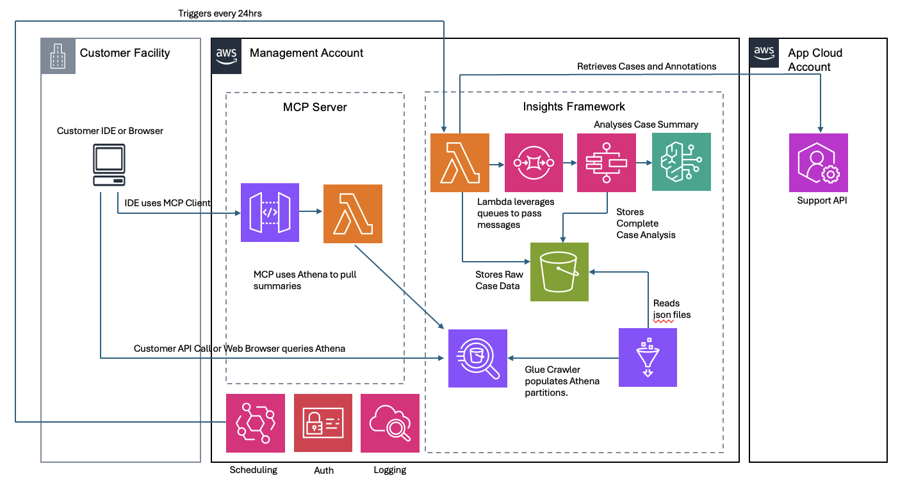

# Suppoort Case Insights with Amazon Bedrock

A solution for gaining insights from AWS support cases using Generative AI.

## Overview

Case Insights is a serverless solution that automatically collects, processes, and analyzes AWS support cases across multiple accounts within an organization. By leveraging AWS services and generative AI, the system provides valuable insights into root causes and lifecycle improvement opportunities, enabling organizations to shift from reactive firefighting to proactive governance.  

This is sample code, for non-production usage. You should work with your security and legal teams to meet your organizational security, regulatory and compliance requirements before deployment into a production environment.

## Architecture



The system follows a serverless architecture pattern, using:
- AWS Lambda functions for processing
- Amazon S3 buckets for storage
- Amazon SQS queues for message passing
- AWS Step Functions for orchestration
- Amazon Bedrock for AI-powered analysis

## Features

- Automatic retrieval of support cases across multiple AWS accounts
- AI-powered case summarization
- Root cause analysis categorization
- Lifecycle improvement recommendations
- Comprehensive monitoring and observability
- Athena query support for data analysis (optional)

## Prerequisites

- AWS CLI installed and configured
- AWS Organization with multiple accounts
- Permissions to deploy CloudFormation templates
- Permissions to create IAM roles and policies
- Access to AWS Bedrock

## Installation

The Support Case Insights solution offers **two deployment paths**:

### **Path 1: Standard Deployment** 
Core case processing without analytics components
- Minimal resource footprint
- Lower costs
- Manual analytics setup option

### **Path 2: Analytics-Enabled Deployment**
Core processing + automated Athena/QuickSight setup
- Ready-to-use SQL queries
- QuickSight dashboard integration
- Infrastructure-as-code analytics

### **Optional: MCP Server Deployment**
Lambda based MCP solution setup
- Can be consumed by an MCP client in your IDE or existing models
- Language based exploration of case trends

**Quick Start:**
1. Clone this repository
2. Package Lambda functions
3. Choose your deployment path
4. Deploy the CloudFormation template
5. **⚠️ CRITICAL: Set up cross-account permissions to retrieve cases from AWS accounts**

For detailed instructions for both paths, see the [Installation Guide](docs/installation.md).

> **IMPORTANT - Don't Skip Cross-Account Setup!**
> 
> After deploying the main stack, you **MUST** deploy the `Support-Case-Analysis-Role` to each child account in your organization. Without this role, the solution cannot access support cases from child accounts and will not function properly.
> 
> **Quick Cross-Account Setup:**
> ```bash
> # Deploy this to EACH child account
> aws cloudformation deploy \
>   --template-file cloudformation/child-account-role.yaml \
>   --stack-name support-case-analysis-role \
>   --capabilities CAPABILITY_NAMED_IAM \
>   --parameter-overrides \
>     ManagementAccountId=<your-management-account-id> \
>     OrganizationId=<your-organization-id>
> ```
> 
> See [Installation Guide - Cross-Account Setup](docs/installation.md#4-set-up-cross-account-access) for detailed instructions.

**Important:** Before deploying, review the [IAM Roles and Permissions](docs/permissions.md) documentation to understand the security model, the [Security Guide](docs/security.md) for comprehensive security architecture details, and the [AWS Resources Created](docs/resources.md) documentation to understand what will be deployed in your account.  This sample should be deployed into a development environment for evaluation before promoting to production.  Tradeoffs have been made around KMS and Logging to simplify the deployment, see security.md for details.

## Usage

For detailed usage instructions, see the [Usage Guide](docs/usage.md).

## **Updating AI Prompts**

The Support Case Insights solution uses AI prompts stored in a Lambda layer to analyze support cases. If you want to customize or improve the AI analysis prompts, follow these steps:

### **When to Update Prompts**
- Customize case summarization logic
- Improve root cause analysis categorization
- Enhance lifecycle analysis recommendations
- Add new analysis categories or criteria

### **How to Update Prompts**

1. **Modify the prompt templates** in the `templates/` directory:
   - `templates/summary-template.txt` - Case summarization prompt
   - `templates/rca-template.txt` - Root cause analysis prompt  
   - `templates/lifecycle-template.txt` - Lifecycle analysis prompt

2. **Repackage the Lambda layer** with updated templates:
   ```bash
   # From the repository root directory
   ./scripts/package-lambdas.sh <your-deployment-bucket> <your-region>
   ```

3. **Force Lambda layer update** by updating the deployment timestamp:
   ```bash
   # Deploy with new timestamp to force layer update
   aws cloudformation deploy \
     --template-file cloudformation/case-insights-updated.yaml \
     --stack-name aws-case-insights \
     --capabilities CAPABILITY_NAMED_IAM \
     --region <your-region> \
     --parameter-overrides \
       DeploymentTimestamp=$(date +%Y-%m-%d-%H-%M-%S)
       # Include all your other existing parameters
   ```

### **What Happens During Prompt Updates**
- **New Lambda layer version** created with updated prompts
- **AI analysis functions updated** to use new layer version
- **No service interruption** - updates happen in-place
- **New cases processed** with updated prompts immediately
- **Existing case data** remains unchanged

### **Testing Prompt Changes**
After updating prompts, monitor the AI analysis results:
- Check CloudWatch logs for the Step Functions
- Review case summaries in S3 for quality improvements
- Verify new categorizations match your expectations

> **Pro Tip:** The `DeploymentTimestamp` parameter is specifically designed to force Lambda layer updates when you modify prompts or other layer content. Always use a new timestamp when you want to deploy prompt changes.  Remember to re-package your Lambda functions to ensure they contain the latest layer when you run the update.

## Documentation

- [Installation Guide](docs/installation.md)
- [Usage Guide](docs/usage.md)
- [Architecture Overview](docs/architecture.md)
- [IAM Roles and Permissions](docs/permissions.md)
- [AWS Resources Created](docs/resources.md)
- [Logging and Troubleshooting](docs/logging.md)
- [Monitoring and Observability](docs/monitoring.md)
- [Athena Queries](docs/athena.md)

## License

This project is licensed under the MIT No Attribution License - see the [LICENSE](LICENSE) file for details.

## Disclaimer

The sample code provided in this solution is for educational purposes only and users should thoroughly test and validate the solution before deploying it in a production environment.