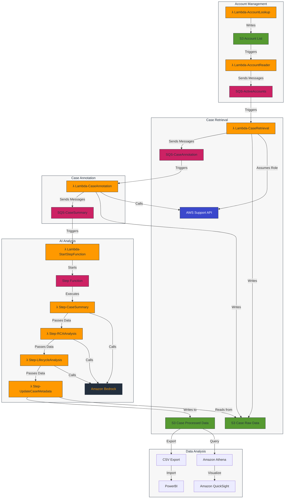

# Support Case Insights with Amazon Bedrock Architecture

This document provides a visual representation of the Support Case Insights solution architecture using AWS-specific icons and components.

## High-Level Architecture Diagram

## Architecture Components

*Figure 1: Support Case Insights Solution Architecture*

### Account Management
- **Lambda-AccountLookup**: Retrieves active AWS accounts from an organization
- **S3 Account List**: Stores the list of active AWS accounts
- **Lambda-AccountReader**: Reads account list and sends messages to SQS
- **SQS-ActiveAccounts**: Queue of active AWS accounts for case retrieval

### Case Retrieval
- **Lambda-CaseRetrieval**: Retrieves support cases for an account
- **AWS Support API**: API for accessing AWS support cases
- **S3 Case Raw Data**: Stores raw support case data during processing
- **S3 Case Processed Data**: Stores complete case data with AI-generated insights
- **SQS-CaseAnnotation**: Queue of cases for annotation retrieval

### Case Annotation
- **Lambda-CaseAnnotation**: Retrieves case communications
- **SQS-CaseSummary**: Queue of cases for AI analysis

### AI Analysis
- **Lambda-StartStepFunction**: Starts the AI analysis step function
- **Step Function**: Orchestrates the AI analysis workflow
- **Step-CaseSummary**: Generates case summary using AI
- **Step-RCAAnalysis**: Categorizes root cause using AI
- **Step-LifecycleAnalysis**: Identifies lifecycle improvement opportunities using AI
- **Step-UpdateCaseMetadata**: Updates case metadata with AI insights
- **Amazon Bedrock**: AI service for generating insights

### Data Analysis
- **Amazon Athena**: Query service for analyzing case data
- **Amazon QuickSight**: Visualization service for creating dashboards
- **CSV Export**: Script for exporting case data to CSV files
- **PowerBI**: Alternative visualization tool for analyzing CSV data

## Data Flow

1. The Lambda-AccountLookup function retrieves active AWS accounts and stores them in an S3 bucket
2. The Lambda-AccountReader function reads the account list and sends a separate message for each account to SQS-ActiveAccounts
3. The Lambda-CaseRetrieval function processes each account, retrieves support cases, and stores them in the raw data S3 bucket
4. The Lambda-CaseAnnotation function retrieves case communications and stores them in the raw data S3 bucket
5. The Lambda-StartStepFunction function starts a step function for AI analysis
6. The step function executes four Lambda functions sequentially for AI-powered analysis:
   - Step-CaseSummary: Generates a concise summary of the case
   - Step-RCAAnalysis: Categorizes the root cause of the case
   - Step-LifecycleAnalysis: Identifies lifecycle improvement opportunities
   - Step-UpdateCaseMetadata: Reads from raw data bucket and writes complete case data with AI insights to processed data bucket
7. The processed results are stored in the processed data S3 bucket for querying and visualization using either:
   - Amazon Athena and QuickSight
   - CSV Export and PowerBI

## Key Features

- **Serverless Architecture**: Uses AWS Lambda, Amazon S3, Amazon Simple Queue Service (Amazon SQS), and AWS Step Functions for a scalable, serverless solution
- **Cross-Account Support**: Retrieves support cases from multiple AWS accounts
- **AI-Powered Analysis**: Uses Amazon Bedrock to generate insights from support cases
- **Flexible Data Analysis**: Supports both Amazon Athena/QuickSight and CSV/PowerBI for data analysis
- **Comprehensive Monitoring**: Includes Amazon CloudWatch dashboards and alarms for monitoring the solution

## Security Considerations

- **IAM Roles and Permissions**: Uses least privilege principle for all IAM roles
- **Cross-Account Access**: Uses the Support-Case-Analysis-Role for secure cross-account access
- **Data Protection**: Ensures data remains within the AWS account boundary
- **S3 Bucket Policies**: Implements appropriate S3 bucket policies to restrict access